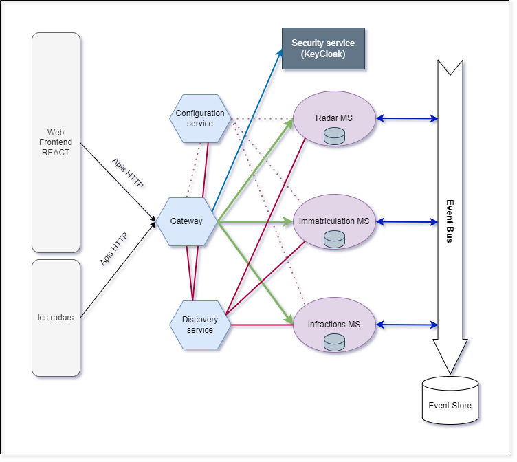
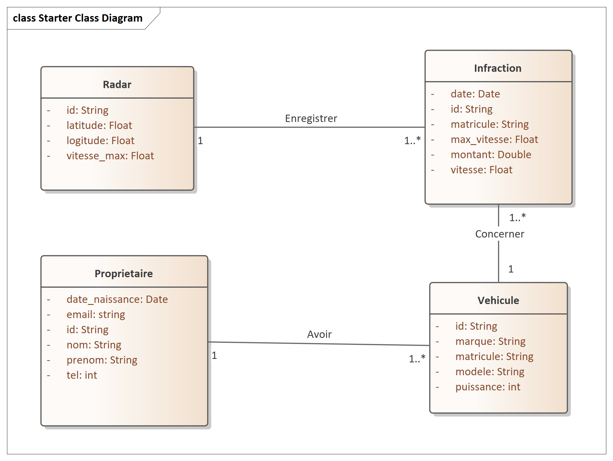

 

# Radar app

Un système distribué basé sur les micro-services en utilisant une architecture pilotée par les événements respectant les deux patterns Event Sourcing et CQRS. Cette application devrait permettre de gérer les infractions concernant des véhicules suites à des dépassement de vitesses détectés par des radars automatiques. Le système se compose de trois micro-services

* **Le micro-service qui permet de gérer les radars**. Chaque radar est défini par son id, sa vitesse maximale, des
  coordonnées : Longitude et Latitude.
* **Le micro-service d’immatriculation qui permet de gérer des véhicules appartenant des propriétaires**. Chaque
  véhicule appartient à un seul propriétaire. Un propriétaire est défini par son id, son nom, sa date de naissance, son
  email et son email. Un véhicule est défini par son id, son numéro de matricule, sa marque, sa puissance fiscale et son
  modèle.
* **Le micro-service qui permet de gérer les infractions**. Chaque infraction est définie par son id, sa date, le numéro
  du radar qui a détecté le dépassement, le matricule du véhicule, la vitesse du véhicule, la vitesse maximale du radar
  et le montant de l’infraction

 

> [👉 L'énnoncé](./Assets/ennoncé.pdf)

 

# Architecture technique du projet

    

 

# Diagramme de classe global du projet

    

 

# Developpement du MS Radar
